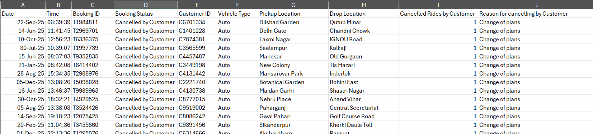
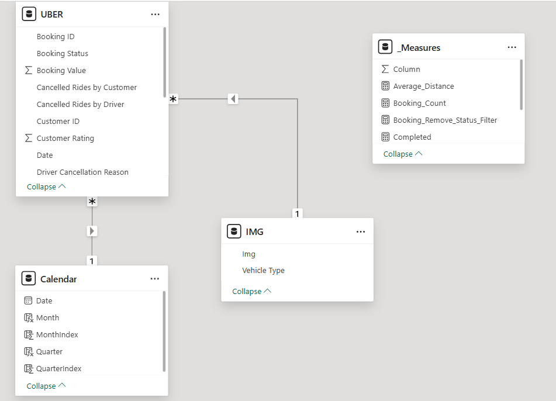
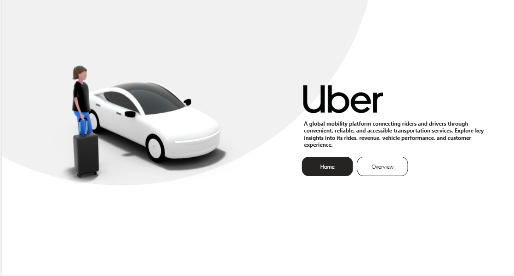
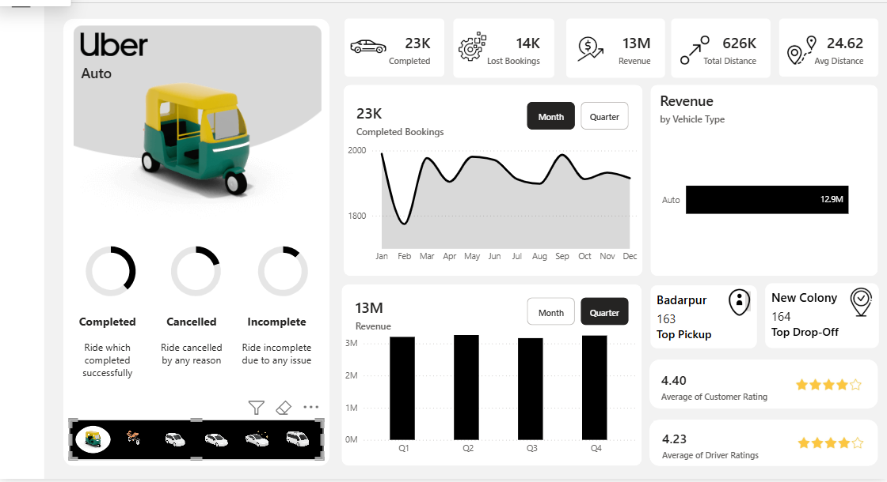

# 🚕 Uber Trip Analysis Dashboard


## Overview

This project analyzes Uber trip data to understand booking performance, revenue, vehicle performance, ride distance, cancellations, locations, and customer and driver ratings.

The project uses **Microsoft Power BI** to transform raw Excel data into an interactive dashboard through data preparation, data modeling, DAX measures, and business-focused visualizations.

**Raw Data → Power Query → Data Modeling → DAX Measures → Power BI Dashboard → Business Insights**

---

## 🎯 Business Problem

The business wants to better understand ride and booking performance and identify patterns across vehicle types, booking status, revenue, ride distance, locations, and customer experience.

The key questions explored in the dashboard include:

- How many bookings are completed or lost?
- How much revenue is generated?
- Which vehicle type contributes the most revenue?
- How do completed bookings change over time?
- Which locations have the highest pickup and drop-off activity?
- What is the average ride distance?
- What are the average customer and driver ratings?

---

## 🔄 Project Workflow

```text
                     Raw Uber Data
                           │
                           ▼
                    Excel Dataset
                           │
                           ▼
                      Power Query
                    Data Preparation
                           │
                           ▼
                     Data Modeling
                           │
                           ▼
                      DAX Measures
                           │
                           ▼
                      Power BI
              Dashboard & Visualization
                           │
                           ▼
                    Business Insights
```

---

# 📂 Dataset

The dataset contains **150,000 Uber trip records** with **19 attributes** covering bookings, customers, vehicle types, locations, cancellations, booking value, ride distance, ratings, and payment methods.

### Main Columns

| Column | Description |
|---|---|
| `Date` | Booking date |
| `Time` | Booking time |
| `Booking ID` | Unique booking identifier |
| `Booking Status` | Status of the booking |
| `Customer ID` | Customer identifier |
| `Vehicle Type` | Type of vehicle |
| `Pickup Location` | Pickup location |
| `Drop Location` | Drop-off location |
| `Cancelled Rides by Customer` | Customer cancellation indicator |
| `Reason for cancelling by Customer` | Customer cancellation reason |
| `Cancelled Rides by Driver` | Driver cancellation indicator |
| `Driver Cancellation Reason` | Driver cancellation reason |
| `Incomplete Rides` | Incomplete ride indicator |
| `Incomplete Rides Reason` | Reason for incomplete ride |
| `Booking Value` | Value of the booking |
| `Ride Distance` | Distance travelled |
| `Driver Ratings` | Driver rating |
| `Customer Rating` | Customer rating |
| `Payment Method` | Payment method used |

## Dataset Preview



---

# 🧹 Data Preparation

The raw Excel data was prepared in **Power Query** before being used for analysis.

### Key Activities

- Loaded the Uber dataset into Power BI
- Prepared and organized the source data
- Structured fields for dashboard analysis
- Created a dedicated Calendar table
- Prepared supporting vehicle image data
- Organized DAX measures in a separate measures table

---

# 🔗 Data Model

The Power BI model uses the main **UBER** table together with supporting tables for **date analysis, vehicle images, and DAX measures**.

### Main Tables

- **UBER** – Main trip and booking data
- **Calendar** – Date, month, and quarter analysis
- **IMG** – Vehicle type images used in the dashboard
- **_Measures** – DAX measures used for calculations



---

# 🧮 DAX & Measures

DAX measures were created to calculate and display key business metrics used throughout the dashboard.

### Examples of Measures

- Booking Count
- Completed Bookings
- Lost Bookings
- Average Distance
- Total Revenue
- Booking Status calculations
- Time-based analysis

The dedicated `_Measures` table keeps the analytical calculations organized separately from the main data table.

---

# 🏠 Power BI Dashboard Home Page

A simple home page was created to provide an introduction to the dashboard and allow navigation into the analysis.



---

# 📊 Power BI Dashboard

The main dashboard provides an interactive overview of Uber trip performance using KPI cards, charts, filters, and comparisons.

### Dashboard Includes

- Completed bookings
- Lost bookings
- Total revenue
- Total distance
- Average distance
- Revenue by vehicle type
- Monthly booking trends
- Quarterly revenue
- Top pickup location
- Top drop-off location
- Customer ratings
- Driver ratings
- Booking status analysis
- Vehicle type selection

## Dashboard Preview



---

# 📌 Dashboard Snapshot

The dashboard provides a high-level view of key performance indicators:

| Metric | Value |
|---|---:|
| Completed Bookings | 93K |
| Lost Bookings | 57K |
| Revenue | $52M |
| Total Distance | 3M |
| Average Distance | 24.64 |
| Average Customer Rating | 4.40 |
| Average Driver Rating | 4.23 |

---

# 💡 Business Insights

### Booking Performance

The dashboard shows approximately **93K completed bookings** compared with **57K lost bookings**, highlighting the importance of monitoring booking losses and their causes.

### Vehicle Performance

**Auto** is the highest revenue-generating vehicle type in the dashboard, contributing approximately **$13M**.

### Revenue Trend

Quarterly revenue remains relatively consistent, with each quarter contributing around **$13M**.

### Ride Distance

The average ride distance is approximately **24.64**, providing a benchmark for typical trip length.

### Customer Experience

The average customer rating is **4.40**, while the average driver rating is **4.23**, indicating generally positive ratings across both sides of the service.

### Location Performance

The dashboard highlights the locations with the highest pickup and drop-off activity, helping identify areas with stronger ride demand.

---

# 📁 Project Structure

```text
Uber-Trip-Analysis/
│
├── data/
│   └── uber.xlsx
│
├── Power BI/
│   └── Uber Dashboard.pbix
│
├── images/
│   ├── uber_dataset.png
│   ├── uber_data_model.png
│   ├── uber_home.png
│   └── uber_dashboard.png
│
└── README.md
```

---

# ⚙️ How to Run

## 1. Clone the Repository

```bash
git clone https://github.com/yourusername/uber-trip-analysis.git
cd uber-trip-analysis
```

## 2. Open the Power BI Dashboard

Open:

```text
Power BI/Uber Dashboard.pbix
```

using **Power BI Desktop**.

## 3. Update the Data Source

If required, update the Excel data source path to:

```text
data/uber.xlsx
```

## 4. Refresh the Dashboard

Refresh the dataset in Power BI and use the available filters and visuals to explore the analysis.

---

# 🧰 Tools & Technologies

| Tool | Purpose |
|---|---|
| **Power BI** | Dashboard development and visualization |
| **Power Query** | Data preparation and transformation |
| **DAX** | Measures and analytical calculations |
| **Excel** | Source dataset |
| **Power BI Data Modeling** | Relationships and supporting tables |

---

# 🎓 Skills Demonstrated

**Data Preparation • Power Query • Data Modeling • DAX • Power BI • Data Visualization • Dashboard Design • Business Intelligence • Excel**

---

# 👨‍💻 Author

**Adithya Ruby**

Aspiring Data Analyst focused on transforming data into actionable business insights.

---

## ⭐ Project Summary

**An interactive Power BI project demonstrating data preparation, data modeling, DAX calculations, dashboard design, and business-focused analysis using Uber trip data.**
